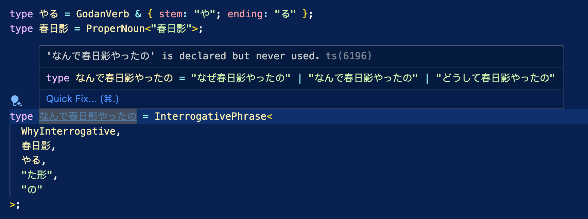

# Typed Korean Playground

**[Open the live playground →](https://typedgrammar.github.io/typed-korean/)**

An interactive tool for the [Typed Korean](../README.md) type-level grammar
library, with two parts:

- **📖 Grammar Course** — a bilingual (English / 简体中文) Korean grammar
  course from elementary to advanced. Every example sentence is backed by a
  self-contained Typed Korean snippet; click any sentence to open it in the
  analyzer and see its grammatical structure. All snippets are verified to
  type-check **and** resolve to exactly the sentence shown
  (`pnpm verify:snippets`).
- **📚 Glossary** — a searchable vocabulary table (`src/vocab`) of every word
  the course uses: kanji, kana reading, romaji, part of speech, and bilingual
  meaning. In the course, each example shows its words as clickable chips —
  click any word to see how it's read and what it means; the structure tree
  shows furigana inline too. A compiler check (`pnpm verify:vocab`) guarantees
  **every** word used in the course is indexed in the table.
- **🧪 Playground** — write a Korean sentence as a TypeScript type and watch
  how it's composed, node by node.



## The analyzer

The analyzer screen has two halves:

- **A real TypeScript editor** (Monaco) with the library's `.d.ts` files loaded.
  It genuinely runs the TypeScript language service — full type-checking, errors,
  and hover. Monaco and its workers are **bundled locally** (not loaded from a
  CDN), so type-checking works in every browser.
- **A sentence-structure tree.** The editor's source is parsed with the
  TypeScript Compiler API into an AST, and the chosen type alias is rendered as
  an indented tree of grammar nodes — `ConditionalPhrase`, `DemonstrativeAction`,
  `ConjugateVerb`, `ProperNoun`, particles, conjugation forms… Each node shows
  the Korean value of its sub-expression, **computed by the TypeScript compiler
  itself** (resolved through Monaco's worker). Click any node to highlight the
  source it came from.

So `ConditionalPhrase<ヒンメル, "なら", DemonstrativeAction<"そう", する, "Ta">>`
becomes a tree you can read top-down to understand exactly how the sentence
`ヒンメルならそうした` is built.

## How the visualization works

1. **Parse** — `src/analysis/parse.ts` runs `ts.createSourceFile` on the editor
   text and walks the type nodes of the selected alias, following local alias
   references and expanding the grammar's compositional constructors into a
   `CompositionNode` tree.
2. **Resolve** — `src/analysis/resolve.ts` evaluates each node by appending a
   throwaway `type __TJ_n = <fragment>;` to a hidden model and reading its
   resolved type from Monaco's TypeScript worker. The compiler reports the
   instantiated string literal (e.g. `"そうした"`) — the real type-level result.
3. **Render** — `src/components/CompositionTree.tsx` draws the indented,
   color-coded tree; selecting a node maps its source span back into the editor.

## Generating snippets with AI (`bun run annotate`)

Turn a plain Korean sentence into a verified Typed Korean snippet and drop it
into the **✨ Generated** group of the Playground gallery:

```bash
bun run annotate "話して"
bun run annotate "綺麗ですね" --title "Na-adjective" --retries 4
bun run annotate "食べた" --dry-run        # verify + print, don't install
```

The workflow (`scripts/annotate.ts`) is the project's *"the type checker grades
the LLM"* thesis as a tool:

1. It prompts `codex exec` (default, via `--engine codex`) with a cheatsheet of
   the library API and asks for a snippet whose **last `type` alias resolves to
   exactly the input sentence** (returned as JSON: `code` / `en` / `title`).
2. It **verifies** the snippet in-memory with the TypeScript Compiler API — it
   must type-check against the real `../src` library *and* its last alias must
   resolve to the input string. A second structure audit rejects `NounPhrase`
   chunks, template-literal glue, particles hidden inside noun strings, and
   leading/trailing whitespace inside technical terms.
3. On failure it feeds the diagnostics back to the selected model and retries
   (`--retries`, default 3). Use `--engine claude` to keep the old Claude CLI
   path. Only a verified snippet is installed; on exhaustion it prints the best
   attempt and writes nothing.

Verified snippets are appended to `src/data/examples.generated.json` (typed and
re-exported by `examples.generated.ts`), kept separate from the hand-curated
`examples.ts`. Requires [Bun](https://bun.sh) and the Codex CLI on your `PATH`
by default.

## Development

```bash
pnpm install
pnpm dev          # Vite dev server
pnpm build        # type-check + production build to dist/
pnpm typecheck
```

## Tech

Vite · React 18 · TypeScript (strict) · `monaco-editor` (self-hosted) ·
`typescript` (in-browser parsing) · CSS Modules.
